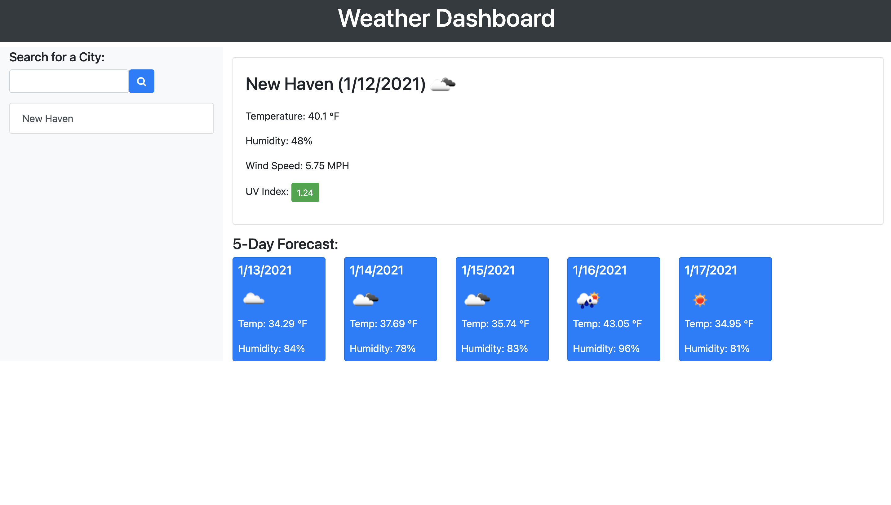

# Weather-Dashboard

## This app allows the user to:

* search for a city 
* get the forecast for the current day
* also get the forecast for the next 5 days
* keep a search log of cities that they have already looked at
* clear that search log

Technologies used were AJAX, BOOTSTRAP, and JQuery. 

<a href = "https://github.com/Drop-G/Weather-Dashboard" alt = "link to Weather-Dashboard repository"> GitHub Repository Link </a>

